<p align="center">
  
</p>

# haili-auto-mkt

<p align="center">
  <a href="./LICENSE"></a>
  
  
  
  
</p>

Reusable Claude Code / Codex skills for marketing outreach workflows.

[中文版 README](./README.zh.md)

## Quick start

Want to see one work in 30 seconds? Try `ph`, the lightest skill in the
set; all it needs is a Product Hunt developer token.

```bash
git clone https://github.com/Haili321/haili-auto-mkt
cd haili-auto-mkt
export PH_ACCESS_TOKEN=your-token-here
python3 skills/ph/scripts/ph_daily.py --picks 5
```

You get the day's PH leaderboard grouped by topic plus 5 cross-category
upvote suggestions. No agent required.

For the full Claude Code / Codex experience, jump to
[One-line install](#one-line-install).

## What's in this repo

| Skill | What it does | Surfaces |
|---|---|---|
| `brevo` | Draft, dry-run, test-send, and officially send transactional outreach emails through Brevo's API. One email per recipient, audit logs per run. | Brevo HTTP API |
| `lark` | Read and write Lark (Feishu international) docs, sheets, drive files, and messages. Ships a `LarkClient` library + one-time OAuth helper + JSON-to-sheet pusher. | Lark Open Platform API |
| `lark-blog` | Turn a Markdown blog draft (with inline image placeholders) into a new Lark docx for review. Posts blocks in batches, uploads PNGs, binds each to its image block. | Lark Open Platform API (depends on `lark` skill) |
| `luma-event-promo` | End-to-end Luma event launch: research comparable events, draft non-AI-sounding copy, create a Private draft, fix Luma's start_at / duration / capacity traps via the admin API, polish theme, font, cover. | Luma admin API + browser UI |
| `ph` | Daily Product Hunt account-warming: pull the leaderboard, group by topic, surface cross-topic upvote suggestions so the account looks like a curious user rather than a single-vertical voter. | Product Hunt GraphQL API |
| `xhs-dm` | Drive the desktop Rednote (Xiaohongshu) app through a daily DM cadence: pick N targets from a queue, search, like, follow, send a DM, mark the result. | macOS desktop app via computer-use |

Each skill is self-contained: an `SKILL.md` Claude or Codex can read,
scripts in `scripts/`, references in `references/`, and copy templates
in `templates/` for the user to fill in.

## How the skills compose

The skills are independent at the Python level (no cross-skill imports),
but they're designed to compose under an agent that orchestrates them.
Typical chains, grouped by the workflow they enable:

Outreach (Lark / Brevo / XHS):

| Chain | Flow |
|---|---|
| `lark` → `brevo` | Read finalised outreach copy and recipients from a Lark doc or sheet; the agent assembles a Brevo request JSON per recipient; `brevo` dry-runs, test-sends, then officially sends. |
| `lark` → `xhs-dm` | The agent reads a blogger list from a Lark sheet via `LarkClient.get_sheet_values`, transforms rows into the `queue.json` schema, and hands off to `xhs-dm`. |
| `xhs-dm` → `lark` | After `pick_today.py` and a DM run, the agent calls `LarkClient.update_sheet_values` to tick a status column on the source sheet, keeping the Lark tracker in sync with `queue.json`. |
| `brevo` + `xhs-dm` | Run `brevo` email outreach first; after a follow-up window, the agent moves no-reply recipients into the `xhs-dm` queue for a second channel. |

Content (blog drafts):

| Chain | Flow |
|---|---|
| draft → `lark-blog` → reviewers | An author finalises a Markdown blog draft; `lark-blog` posts it as a Lark docx with inline images; reviewers comment in Lark; the author publishes to the company's official website blog once approved. |

Events (Luma):

| Chain | Flow |
|---|---|
| `luma-event-promo` → `brevo` | After the event, the agent exports the RSVP list (via Luma's admin API), assembles a per-attendee Brevo request, and `brevo` sends a thank-you + follow-up resource email one recipient at a time. |
| `luma-event-promo` → `lark` | The agent syncs the live RSVP / waitlist count into a Lark sheet column so the team can watch fill-rate without logging into Luma. |
| `luma-event-promo` → `lark-blog` | After the event, the agent drafts a recap Markdown (photos, attendance, key moments) and `lark-blog` posts it as a Lark docx for review before publishing to the company's official website blog. |

Account presence (PH):

| Chain | Flow |
|---|---|
| `ph` → `lark` | The agent pulls the day's PH leaderboard, picks cross-topic targets, then writes the picks (with reasoning) into a Lark sheet so daily activity is auditable. |
| `ph` + outreach | When `ph` surfaces a maker worth contacting, the agent can pass their handle into `brevo` (if there's an email on file) or queue them for `xhs-dm` (if they're on Xiaohongshu). |

These chains are orchestrated by the agent reading each skill's `SKILL.md`
and the references; no glue scripts ship in this repo yet. If a chain
becomes routine, the natural next step is to add a small driver script
under the skill that owns the destination side.

## One-line install

Paste this sentence to Claude Code or Codex:

```text
Install haili-auto-mkt from https://raw.githubusercontent.com/Haili321/haili-auto-mkt/main/install.sh into the default skills dir for the current agent, then run a health check.
```

Or run the installer yourself:

```bash
curl -fsSL https://raw.githubusercontent.com/Haili321/haili-auto-mkt/main/install.sh | bash
```

The installer copies each subdirectory of `skills/` into
`~/.claude/skills/` (or `${CODEX_HOME:-~/.codex}/skills/` for Codex) and
skips skills that are already installed. Pass `--agent claude` or
`--agent codex` to force a target, or `--dest /custom/path` to install
elsewhere.

## Direct shell usage

You can also call the scripts without going through an agent. From a
local clone, the minimal command per skill:

### brevo

```bash
export BREVO_API_KEY=your-key-here
cp skills/brevo/templates/minimal_request.example.json ./email_request.json
# Edit ./email_request.json with your real sender + recipients + copy.
bash skills/brevo/scripts/bootstrap_runtime.sh --request-file ./email_request.json
# Dry-run output appears under ./brevo-output/<timestamp>/.
```

### lark

```bash
cp skills/lark/templates/lark_config.example.json ./lark_config.json
# Edit with your real app_id + app_secret.
python3 skills/lark/scripts/lark_auth.py   # one-time browser OAuth
python3 skills/lark/scripts/push_to_sheet.py \
  --sheet-token SHEET_TOKEN --range 'Sheet1!A1' --json-file ./rows.json
```

### lark-blog

```bash
python3 skills/lark-blog/scripts/push_blog_to_lark.py \
  --md ./post.md --images-dir ./images --title 'Draft v1'
# Depends on the lark skill being installed alongside; see SKILL.md.
```

### luma-event-promo

```bash
export LUMA_COOKIE='luma.did=...; luma.auth-session-key=usr-...'
export LUMA_EVENT_ID='evt-XXXXXXXXXXXXX'
python3 skills/luma-event-promo/scripts/update_event.py --get
# To edit: pass --start-at / --duration / --capacity / --tint-color etc.
```

### ph

```bash
export PH_ACCESS_TOKEN=your-token-here
python3 skills/ph/scripts/ph_daily.py --picks 5
```

### xhs-dm

```bash
cp skills/xhs-dm/templates/queue.example.json ./queue.json
cp skills/xhs-dm/templates/dm-message.example.md ./dm-message.md
# Edit both files with your real targets and copy.

python3 skills/xhs-dm/scripts/pick_today.py --queue ./queue.json --count 2
# (run the SOP in Rednote by hand or via an agent)
python3 skills/xhs-dm/scripts/mark_sent.py --queue ./queue.json 2 3
```

## Layout

```
haili-auto-mkt/
├── install.sh              # one-shot installer for Claude Code / Codex
├── skills/
│   ├── brevo/              # Brevo transactional email
│   │   ├── SKILL.md
│   │   ├── scripts/        # run_brevo_email.py + bootstrap wrapper
│   │   ├── references/     # request schema
│   │   ├── templates/      # minimal + outreach request templates
│   │   └── .env.example
│   ├── lark/               # Lark / Feishu international API
│   │   ├── SKILL.md
│   │   ├── scripts/        # lark_client.py + lark_auth.py + push_to_sheet.py
│   │   ├── references/     # auth-flow + sheet-recipes
│   │   └── templates/      # lark_config.example.json
│   ├── lark-blog/          # Markdown blog -> Lark docx with inline images
│   │   ├── SKILL.md
│   │   ├── scripts/        # push_blog_to_lark.py
│   │   └── templates/      # sample-blog.md
│   ├── luma-event-promo/   # End-to-end Luma event launch + polish
│   │   ├── SKILL.md
│   │   ├── scripts/        # update_event.py + build_description.py
│   │   └── references/     # api-cheatsheet + copy-templates + event styles + gotchas
│   ├── ph/                 # Product Hunt daily warming
│   │   ├── SKILL.md
│   │   ├── scripts/        # ph_daily.py
│   │   └── templates/      # ph_tokens.example.json
│   └── xhs-dm/             # Xiaohongshu desktop DM workflow
│       ├── SKILL.md
│       ├── scripts/        # pick_today.py + mark_sent.py
│       ├── references/     # sop + queue-schema
│       └── templates/      # queue + dm-message examples
├── LICENSE
└── README.md
```

## Design notes

- Skills are read-mostly. The agent reads `SKILL.md`, then chooses scripts
  to invoke. State lives in the user's own `queue.json` and DM message file,
  never inside this repo.
- Scripts are dependency-free: standard library Python 3 only. No virtualenv
  needed.
- Privacy first. The `.gitignore` blocks `queue.json` and `dm-message.md` so
  real target lists and outreach copy do not leak into commits.
- External integrations such as Lark, Notion, Airtable are deliberately not
  built in. Wrap `mark_sent.py` in your own driver if you want to mirror
  results to an external sheet.

## License

MIT. See [LICENSE](./LICENSE).
