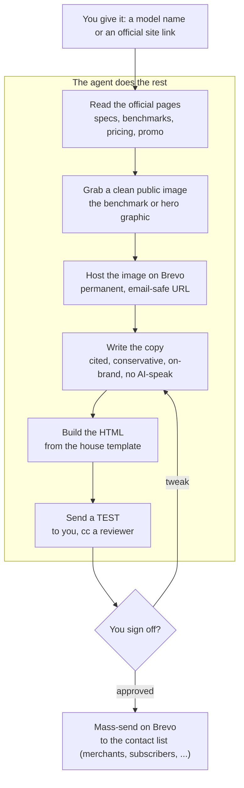

# Brevo Email Skill

[中文](README.zh.md)

Turn one link into a reviewed, ready-to-send launch email.

Hand the agent a model name or an official product link. It reads the page
itself (text and images), drafts an on-brand email, hosts the image, and sends
you a test. You review, then mass-send to your contact list on Brevo. The agent
drafts and tests; a human always approves the blast.

## The pipeline



## What goes in, what comes out

| You provide | The agent produces |
|---|---|
| A model name or official link | Facts pulled and cited from the official pages |
| Which list to send to (later) | The image, hosted on Brevo with a permanent URL |
| Sign-off on the test | A drafted, on-brand email and a test in your inbox |
|  | A Brevo draft campaign, staged for the approved blast |

## How it works, step by step

1. **Read the source.** The agent opens the vendor's official site and your
   platform's model page and pulls the numbers (benchmarks, context window,
   pricing, promo dates), keeping a source next to every claim so review is a
   fast spot-check.
2. **Get the image.** Benchmark charts on a site are often live SVG with no
   downloadable URL. The agent finds the same chart as a flat image on the
   vendor CDN and imports it to Brevo with `brevo_image_import.py`, which returns
   a permanent, email-safe URL. (No hot-linking a third-party CDN that expires.)
3. **Write the copy.** House style: only claims the source supports (no "beats
   everyone" if the chart says otherwise), short human sentences, no em dashes,
   one clear call to action.
4. **Build it.** `build_model_email.py` fills `model_launch.template.html` from a
   small spec JSON and writes both the HTML and a ready Brevo request.
5. **Test it.** The email goes to you (cc a reviewer) as a `TEST -` send, so you
   see exactly what recipients will get.
6. **Send it.** After your sign-off, the campaign goes out to the contact list
   from Brevo.

## The human stays in the loop

The agent never blasts a real list on its own. It always stops at a draft plus a
test. A person checks the claims, the pricing, and the look, then approves the
send. Fast, without putting unchecked marketing claims in front of customers.

## Try it

```bash
# 0. set BREVO_API_KEY in your shell or a local .env.local (see .env.example)

# 1. host an image, get a permanent Brevo URL
scripts/brevo_image_import.py --url https://host/benchmark.jpeg --name model-bench

# 2. build the email from a spec
scripts/build_model_email.py --spec spec.json \
  --out-html email.html --out-request request.json

# 3. send yourself a test
scripts/bootstrap_runtime.sh --request-file request.json \
  --test-to you@example.com --send
```

Start from [`templates/model_launch_spec.example.json`](templates/model_launch_spec.example.json)
and the full [`references/urgent-launch.md`](references/urgent-launch.md) playbook.

## What's in here

| File | What it is |
|---|---|
| [`SKILL.md`](SKILL.md) | The skill spec the agent follows |
| [`references/urgent-launch.md`](references/urgent-launch.md) | The full urgent-launch playbook |
| [`references/request-schema.md`](references/request-schema.md) | Request JSON schema for one-off sends |
| [`scripts/brevo_image_import.py`](scripts/brevo_image_import.py) | Import a public image into Brevo, get a hosted URL |
| [`scripts/build_model_email.py`](scripts/build_model_email.py) | Fill the template from a spec into HTML + request |
| [`scripts/run_brevo_email.py`](scripts/run_brevo_email.py) | Render, dry-run, test-send, or send one email |
| [`templates/model_launch.template.html`](templates/model_launch.template.html) | The tokenized email template (`[[ ]]` tokens) |
| [`templates/model_launch_spec.example.json`](templates/model_launch_spec.example.json) | A worked example spec |

> The published template and example carry no real names, addresses, account
> IDs, or links. Fill them in from your own `.env.local` and spec.
