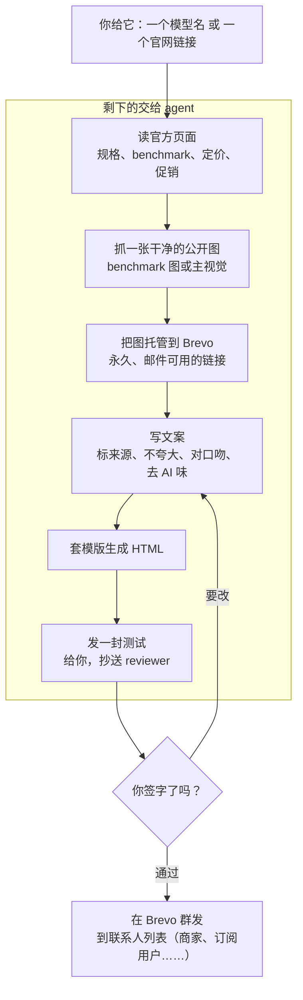

# Brevo 邮件技能

[English](README.md)

一个链接，变成一封审核过、可以直接群发的发布邮件。

给 agent 一个模型名或一个官方产品链接。它自己读页面（文本和图），写出符合品牌口吻的邮件初稿，把图托管好，发一封测试给你。你审核通过后，在 Brevo 群发到联系人列表。agent 只负责出稿和测试，群发这一步永远由人放行。

## 流水线



## 输入什么，产出什么

| 你提供 | agent 产出 |
|---|---|
| 一个模型名或官方链接 | 从官方页面抓取并标注来源的事实 |
| 之后再定发哪个列表 | 托管在 Brevo、带永久链接的图片 |
| 对测试稿签字放行 | 一封写好的对品牌邮件 + 你收件箱里的测试 |
|  | 一个 Brevo 草稿 campaign，等放行后群发 |

## 工作流程，分步

1. 读来源。agent 打开厂商官网和你平台的模型页，抓出数字（benchmark、上下文长度、定价、促销日期），每条都记下出处，方便你秒核。
2. 抓图。页面上的 benchmark 图常是实时 SVG，没有可下载链接；agent 会在厂商 CDN 上找到同一张图的扁平图片，用 `brevo_image_import.py` 导入 Brevo，拿到一个永久、邮件可用的链接（不外链会过期的第三方 CDN）。
3. 写文案。口径：只说官方支持的结论（图里输了就不写 beats everyone）、短句、不用破折号、单个明确 CTA。
4. 生成。`build_model_email.py` 用一个小的 spec JSON 填 `model_launch.template.html`，同时写出 HTML 和现成的 Brevo 请求。
5. 测试。邮件以 `TEST -` 前缀发给你（抄送 reviewer），你看到的就是收件人会收到的样子。
6. 发送。你签字后，campaign 在 Brevo 群发到联系人列表。

## 人始终在环内

agent 绝不自己群发真实列表，永远停在草稿 + 测试。由人核对宣称、定价和版式后再放行。这样既快，又不会把没核过的营销说法直接推到客户面前。

## 试一下

```bash
# 0. 先在 shell 或本地 .env.local 里配置 BREVO_API_KEY（见 .env.example）

# 1. 托管一张图，拿到永久 Brevo 链接
scripts/brevo_image_import.py --url https://host/benchmark.jpeg --name model-bench

# 2. 用 spec 生成邮件
scripts/build_model_email.py --spec spec.json \
  --out-html email.html --out-request request.json

# 3. 给自己发一封测试
scripts/bootstrap_runtime.sh --request-file request.json \
  --test-to you@example.com --send
```

从 [`templates/model_launch_spec.example.json`](templates/model_launch_spec.example.json)
和完整的 [`references/urgent-launch.md`](references/urgent-launch.md) playbook 起步。

## 目录里有什么

| 文件 | 是什么 |
|---|---|
| [`SKILL.md`](SKILL.md) | agent 遵循的技能说明 |
| [`references/urgent-launch.md`](references/urgent-launch.md) | 完整的 urgent-launch playbook |
| [`references/request-schema.md`](references/request-schema.md) | 单封发送的请求 JSON schema |
| [`scripts/brevo_image_import.py`](scripts/brevo_image_import.py) | 把公开图片导入 Brevo，拿到托管链接 |
| [`scripts/build_model_email.py`](scripts/build_model_email.py) | 用 spec 填模版，生成 HTML + 请求 |
| [`scripts/run_brevo_email.py`](scripts/run_brevo_email.py) | 渲染、dry-run、测试发送、正式发送 |
| [`templates/model_launch.template.html`](templates/model_launch.template.html) | 占位符化的邮件模版（`[[ ]]` 占位符） |
| [`templates/model_launch_spec.example.json`](templates/model_launch_spec.example.json) | 一个填好的示例 spec |

> 公开的模版和示例里没有任何真实姓名、地址、账号 ID 或链接。用你自己的 `.env.local` 和 spec 填进去即可。
