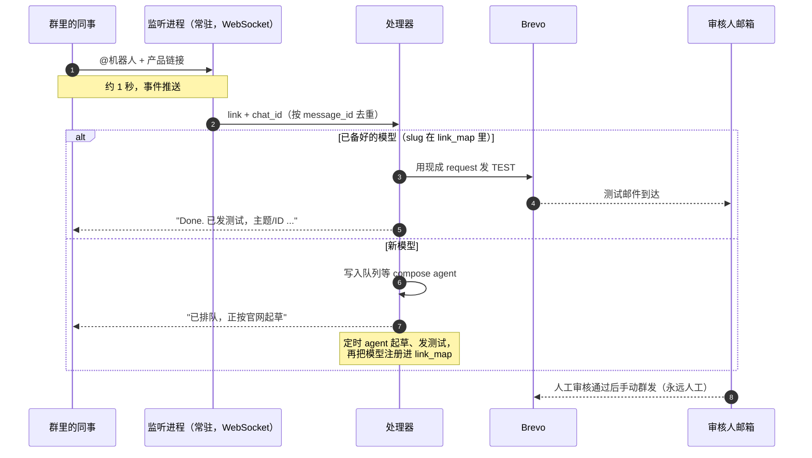

# Lark Launch Trigger

[English](README.md)

在群里 @ 一下机器人、带上链接，两秒后审核邮件就到收件箱。

这个技能是 [brevo 发布流水线](../brevo/README.zh.md) 缺的那个触发器：
不用再手动唤起 agent，同事在 Lark 群里 @ 机器人 + 产品链接，流水线自己
启动。监听进程和 Lark 之间保持一条长连接 WebSocket（进程主动向外拨，
不需要公网服务器、不开入站端口、也不轮询），事件大约 1 秒内推到本地。

## 流程



实测：从 @ 到「审核人收到测试邮件 + 群里收到状态回贴」全程约 2 秒。

## 为什么用长连接

| | 轮询历史 | Webhook 回调 | 长连接（本技能） |
|---|---|---|---|
| 延迟 | 分钟级（cron 间隔） | 约 1 秒 | 约 1 秒 |
| 要公网服务器 | 不要 | 要 | 不要 |
| 会漏消息 | 两次轮询之间可能漏 | 不会 | 不会 |
| 配置量 | 消息读取权限 | URL + 签名校验 | 控制台一个开关 |

轮询版也保留了（`scripts/poll_trigger.py`），给跑不了常驻进程的环境用。

## 快速开始

```bash
# 1. 两个配置（都被 gitignore）
cp skills/lark/templates/lark_config.example.json ./lark_config.json
cp skills/lark-launch-trigger/templates/trigger_config.example.json ./trigger_config.json
# 填：应用凭证、reviewer_email、url_filter、link_map

# 2. 控制台一次性设置（长连接 + 接收消息事件 + 发布版本）
#    -> references/event-subscription.md（务必读 webhook 机器人那个坑！）

# 3. 跑起来
python3 -m pip install lark-oapi
python3 skills/lark-launch-trigger/scripts/lark_at_listener.py   # 前台
bash skills/lark-launch-trigger/deploy/install.sh "$PWD"         # 或 launchd 常驻
```

然后在群里：

```
@你的机器人 https://your-platform.example.com/models/your-model
```

## 必须提前知道的一个坑

一个群里可能同时有应用机器人和自定义 webhook 机器人，成员列表里看起来
一模一样。只有 @ 应用自己的机器人才会触发事件；webhook 机器人只能往群里
发，永远收不到。如果 WebSocket 连得好好的但事件一直不来，大概率 @ 错了
机器人。细节和 id 核对方法：[references/event-subscription.md](references/event-subscription.md)。

## 安全模型

这个触发器最多只会发一封 TEST 邮件给配置好的审核人。没见过的链接只入队、
不发送。对真实联系人列表的群发永远是人在 Brevo 里手动操作。
